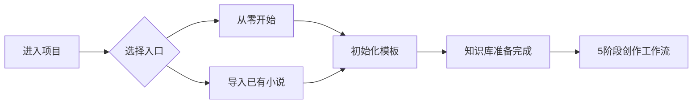

# Craft Companion

**让 AI 真正理解你的小说，而不是每章都重新猜。**

AI 协作小说创作框架 · **结构化知识库 + 双入口初始化 + 5阶段工作流**


---

## 选择你的起点

### 从零开始写新小说
适合：还没有正文，想和 AI 一起搭建作品。

你会走这条路：
- 创建项目
- 打开 `提示模板/从零开始/`
- 按 01 → 05 完成初始化
- 再进入正式创作

### 导入已有小说
适合：已经写了几章、几十章，想迁移到 Craft Companion。

你会走这条路：
- 创建项目
- 打开 `提示模板/导入已有小说/`
- 按 01 → 05 完成导入
- 再进入正式创作

> **一句话理解**：
> - 没有正文 → 走 **从零开始**
> - 已有正文 → 走 **导入已有小说**

---

## 30 秒开始

```bash
git clone https://github.com/qcx1919788736-collab/craft-companion.git
cd craft-companion
node tools/init.js
```

初始化时选择：
- 从零开始写新小说
- 导入已有小说

然后按生成的 `START_HERE.md` 往下走。

---

## 工作方式



---

## 快速开始

### 1. 获取项目

```bash
git clone https://github.com/qcx1919788736-collab/craft-companion.git
cd craft-companion
```

### 2. 创建项目

```bash
node tools/init.js
```

创建完成后会生成：
- 项目目录
- `CLAUDE.md`
- 基础知识库目录
- `START_HERE.md`（告诉你下一步去哪）

### 3. 按你的模式继续

#### 如果你选了“从零开始”
按顺序使用：
- `提示模板/从零开始/01-定义核心概念.md`
- `提示模板/从零开始/02-构建主角.md`
- `提示模板/从零开始/03-设计故事结构.md`
- `提示模板/从零开始/04-建立文风.md`
- `提示模板/从零开始/05-准备开始创作.md`

#### 如果你选了“导入已有小说”
按顺序使用：
- `提示模板/导入已有小说/01-提取人物信息.md`
- `提示模板/导入已有小说/02-提取世界观设定.md`
- `提示模板/导入已有小说/03-构建时间线.md`
- `提示模板/导入已有小说/04-分析文风特征.md`
- `提示模板/导入已有小说/05-识别伏笔线索.md`

---

## 正式创作前，你至少要知道这几点

- **工作流版本：5 阶段**
- **项目名统一：Craft Companion**
- **模板目录统一：`提示模板/...`**
- 不再使用旧的 `NovelForge` / `prompts/...` / `template/...` 说法

---

## 5 阶段工作流

1. **章纲**：先生成章节方向或方案
2. **初稿**：写出正文初稿
3. **自查**：检查人物、设定、文风、情感弧线
4. **修订**：根据反馈修改
5. **终版确认**：确认最终版本并更新知识库

这套工作流的目标不是“让 AI 一把写完”，而是让 AI 在稳定约束下持续协作。

---

## 常用命令

```bash
# 创建新项目
node tools/init.js

# 导入已有作品的提示模板辅助
node tools/import-cli.js

# CLI 功能（按当前仓库实际情况使用）
craft-companion --help
```

---

## 推荐使用方式

### 方式 A：Cherry Studio / Claude Code / Cursor / Windsurf
推荐让 AI 先读取：
1. `CLAUDE.md`
2. `START_HERE.md`
3. 你当前步骤对应的模板文件

### 方式 B：OpenClaw / 柴油C6 集成
接入时，第一轮只需要先帮用户分流：
- 从零开始写新小说
- 导入已有小说

分流后再进入具体步骤，不要一上来问很多问题。

---

## 项目结构

```text
Craft Companion/
├── tools/
├── novel-knowledge-mcp-server/
├── docs/
├── 提示模板/
│   ├── 从零开始/
│   └── 导入已有小说/
│
└── 你的项目/
    ├── CLAUDE.md
    ├── START_HERE.md
    ├── 知识库/
    ├── 工作区/
    └── _归档/
```

---

## 核心特点

- **结构化知识库**：人物、设定、故事进展、写作参考分层维护
- **5 阶段工作流**：减少 AI 跑偏
- **提示模板双入口**：从零开始 / 导入已有小说
- **隐私优先**：本地使用，不上传私人创作资料
- **Harness 思路**：不靠“玄学 prompt”，而靠稳定流程

---

## 文档

- `docs/01-快速开始.md`
- `docs/02-知识库设计理念.md`
- `docs/03-导入现有作品.md`
- `docs/04-工作流详解.md`
- `docs/05-自定义与扩展.md`
- `docs/06-Cherry-Studio使用指南.md`
- `docs/07-架构设计原则.md`
- `docs/08-检查点机制.md`

---

## 当前建议

如果你是第一次用，**不要直接看所有文档**。先做这三件事：

1. `node tools/init.js`
2. 打开 `START_HERE.md`
3. 按你的模式完成第一步模板

这样最快，不容易绕晕。
